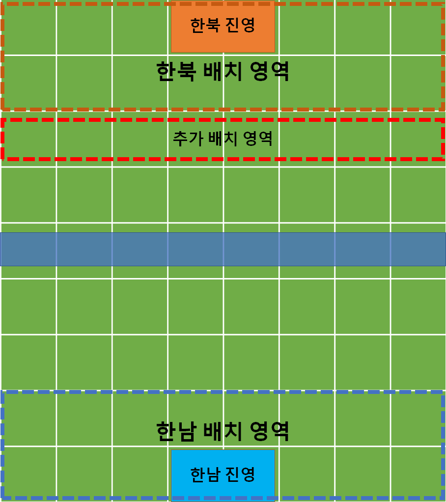
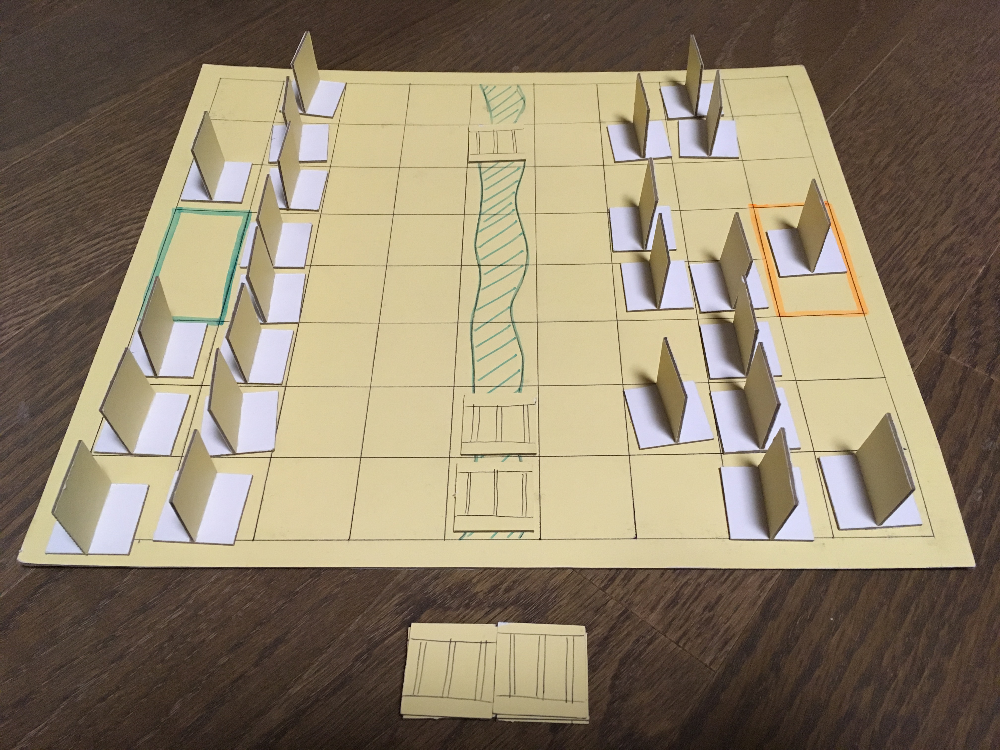
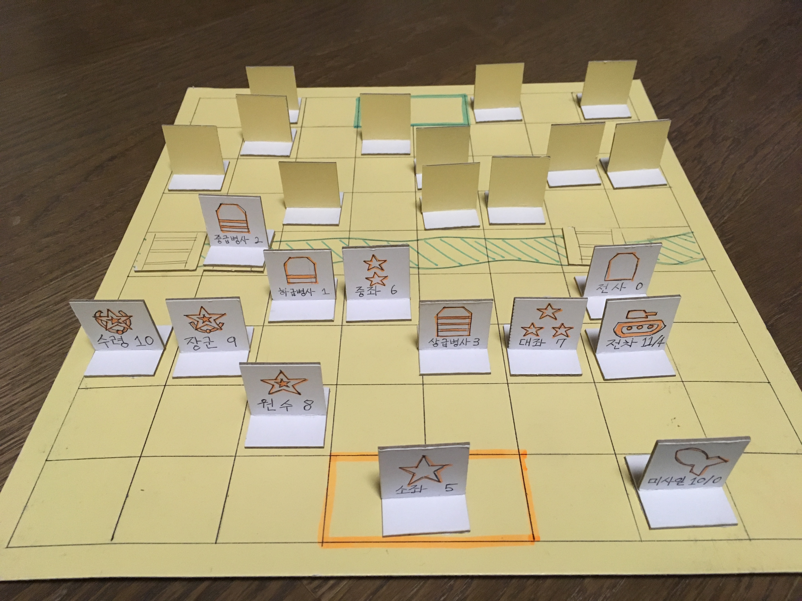
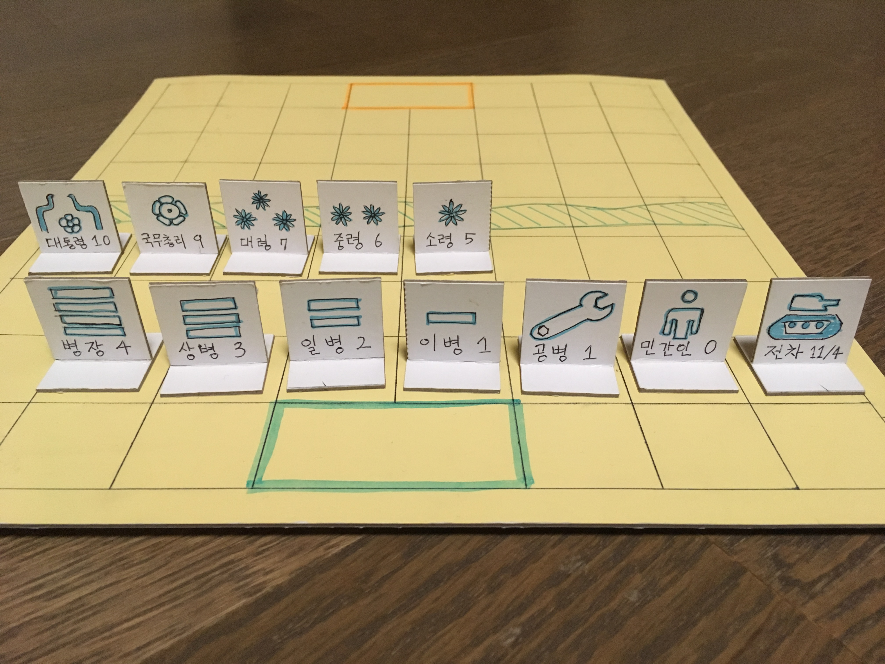
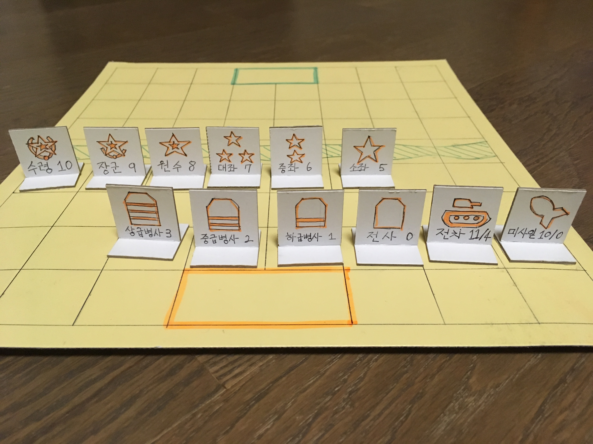

# 전쟁 게-임
설날마다 반복되는 고스톱에 질리셨나요? 더 이상 윷놀이로는 스릴을 느낄 수 없나요? **전쟁 게-임**은 Stratego와 [필드 택틱스](https://namu.wiki/w/%ED%95%84%EB%93%9C%20%ED%83%9D%ED%8B%B1%EC%8A%A4)의 영향을 받아 만들어진, [김치맨](https://namu.wiki/w/%EA%B9%80%EC%B9%98%EB%A7%A8)을 뛰어넘는 [한국형](https://namu.wiki/w/%ED%95%9C%EA%B5%AD%ED%98%95) 대표 보드게임입니다. 가족, 친지, 친구들과 함께 **전쟁 게-임**을 즐기며 숨막히는 두뇌 싸움을 펼쳐보세요. 할아버지, 고모, 외삼촌, 사촌동생의 정치 성향도 함께 알아갈 수 있을 거에요!

## 게임 방법
**전쟁 게-임**은 가상의 국가 [**한남**](https://namu.wiki/w/%EB%82%A8%ED%95%9C)과 [**한북**](https://namu.wiki/w/%EB%B6%81%ED%95%9C) 간의 전쟁을 다룬 게임입니다. 한남과 한북은 서로 한 번 씩 번갈아 가면서 유닛을 움직이거나, 공격하거나, 행동합니다.

게임을 하기 위해서는 **전쟁 게-임** 전용 게임보드와 한남과 한북 각각 13개씩 총 26개의 **전쟁 게-임** 전용 유닛이 필요합니다.

### 1. 게임의 준비
게임은 8 x 9 모양의 직육면체 모양의 **전쟁 게-임** 전용 게임보드에서 진행됩니다. 중앙 5번째 열에는 강이 위치하는데, 이 부분에는 유닛을 놓을 수 없습니다.

한남은 파란 색, 한북은 빨간 색 진영을 사용합니다. 진영은 2 x 1 크기이며 한 칸으로 취급합니다.
1. 먼저 한남이 강 타일 중 원하는 위치에 다리를 세 개 놓습니다. 다리가 위치한 칸은 게임 중에 유닛이 올라갈 수 있습니다.
2. 이 다리 배치를 보고, 한남과 한북은 각자의 유닛을 한 칸에 하나씩 원하는 대로 배치합니다.
    1. 한남과 한북은 각각 상대방의 유닛이 무엇인지 서로 볼 수 없게 배치합니다.
    2. 한남은 한남 배치 영역에, 한북은 한북 배치 영역에 유닛을 배치합니다.
    3. 한북은 추가 배치 영역에 최대 4개까지 더 배치할 수 있습니다.
    4. 중앙 진영 부분에 굳이 유닛을 배치하지 않아도 됩니다.
3. 배치가 끝났다면 [역사적 전통에 의해](https://namu.wiki/w/6.25%20%EC%A0%84%EC%9F%81) 한북이 먼저 시작합니다.

배치가 끝난 모습은 대략 다음과 같습니다.

### 2. 게임의 진행
모든 유닛은 일부 특수한 유닛을 제외하고 상하좌우 한 칸씩만 이동이 가능하며, 대각선으로는 이동할 수 없습니다. 이동하고자 하는 칸에 자신의 유닛이 이미 있다면 그 칸으로는 이동할 수 없으며, 상대방의 유닛이 있다면 해당 유닛을 공격합니다.

게임보드 중앙인 5번째 행에는 강이 있습니다.
- 강이 있는 칸에는 유닛을 놓을 수 없지만, 강 위에 다리가 놓여 있는 칸에는 유닛을 놓을 수 있습니다.
- 다리가 놓여 있는 칸이 연속되어 있어도 다리에서 다른 다리로 이동하거나 공격할 수는 없습니다.

##### 공격과 방어
모든 유닛에는 공격력과 방어력이 존재합니다. 상대방의 유닛을 공격할 때는 공격하는 쪽에서 방어하는 유닛을 직접 확인해 보고, 공격측 유닛의 공격력과 방어측 유닛의 방어력을 비교합니다. 이 공격력과 방어력에 의해 공격/방어가 성공하거나 실패합니다.

- 공격측 유닛의 공격력이 방어측 유닛의 방어력보다 높다면 공격은 성공합니다. 공격당한 유닛은 게임에서 제거하고, 공격한 유닛은 상대방 유닛이 있던 위치로 이동합니다.
- 공격측 유닛의 공격력이 방어측 유닛의 방어력보다 낮다면 공격은 실패합니다. 공격한 유닛은 게임에서 제거됩니다.
- 하지만 공격측 유닛의 공격력과 방어측 유닛의 방어력이 서로 같다면, 공격과 방어 모두 실패하며, 두 유닛 모두 게임에서 제거됩니다.
- 방어측은 공격측 유닛을 확인할 수 없습니다. 방어에 성공/실패 여부는 공격측의 행동을 보고 판단해야 합니다.
- 공격과 방어의 성공/실패를 판단할 때는 거짓말을 해서는 안 됩니다.

즉 어느 쪽에서 공격했든지간에 관계없이 공격력과 방어력을 비교해서 무조건 높은 쪽이 살아남게 됩니다. 하지만 공격한 쪽은 공격당한 상대방 유닛을 확인할 수 있다는 장점이 있습니다.

### 3. 유닛의 구성
##### 한남의 유닛
한남의 유닛은 다음과 같습니다. 전차를 제외하고는 공격력/방어력은 동일합니다.

| 유닛 이름 | 공격력/방어력 |
|:---------:|:-------------:|
| 대통령    | 10            |
| 국무총리  | 9             |
| 대령      | 7             |
| 중령      | 6             |
| 소령      | 5             |
| 병장      | 4             |
| 상등병    | 3             |
| 일등병    | 2             |
| 이등병    | 1             |
| 공병      | 2             |
| 민간인    | 0             |
| 전차      | 11/4          |

몇몇 유닛은 특수 능력이 있습니다.
- 대통령은 **전쟁 게-임**에서 유일하게 다리를 부술 수 있습니다. 대통령이 한남 진영 쪽에 위치해 있다는 전제 하에, 한남 유닛이 다리 위에 있는 경우 [서울은 안전하기 때문에](https://namu.wiki/w/%EA%B5%AD%EB%AF%BC%20%EC%97%AC%EB%9F%AC%EB%B6%84%20%EC%95%88%EC%8B%AC%ED%95%98%EC%8B%AD%EC%8B%9C%EC%98%A4) 게임에서 1회에 한해 유닛과 다리를 한꺼번에 없앨 수 있습니다.
    - 다리를 없애는 행동은 한 턴을 소모합니다.
- 대통령이 게임에서 제외될 경우, 그 즉시 국무총리는 [대통령 권한대행](https://namu.wiki/w/%EB%8C%80%ED%86%B5%EB%A0%B9%20%EA%B6%8C%ED%95%9C%EB%8C%80%ED%96%89)으로서 공격력/방어력이 대통령과 동일하게 10이 됩니다. 하지만 대통령처럼 다리는 없앨 수 없습니다.
- 병장이 게임에서 제외될 경우, 그 즉시 민간인은 예비군으로 복귀하여 공격력/방어력이 병장과 동일하게 4가 됩니다.
- 공병은 **전쟁 게-임**에서 유일하게 다리를 지을 수 있습니다. 공병은 공병이 위치한 칸 주변 (대각선 방향을 포함하여) 8칸 중 다리가 없는 강 타일 위에 다리를 지을 수 있습니다.
    - 다리를 짓는 행동은 한 턴을 소모합니다.
- 전차는 한 칸 대신 두 칸을 이동할 수 있습니다. 공격 역시 마찬가지로 두 칸 떨어진 유닛을 공격할 수 있습니다. 이동과 공격 시에는 직선으로만 이동해야 하며 다른 유닛을 건너뛰거나 강을 건너뛸 수 없습니다.

##### 한북의 유닛
한북의 유닛은 다음과 같습니다.

| 유닛 이름 | 공격력/방어력 |
|:---------:|:-------------:|
| 수령~~님~~| 10            |
| 장군~~님~~| 9             |
| 원수      | 8             |
| 대좌      | 7             |
| 중좌      | 6             |
| 소좌      | 5             |
| 상급병사  | 3             |
| 중급병사  | 2             |
| 하급병사  | 1             |
| 전사      | 0             |
| 전차      | 11/4          |
| 미사일    | 10/0          |

몇몇 유닛은 특수 능력이 있습니다.
- 수령은 한 칸 대신 두 칸을 이동할 수 있으며, 다른 말이나 강을 건너뛸 수 없습니다. 단, 공격할 때는 한 칸 범위에서만 공격할 수 있습니다.
- 장군은 수령이 게임에서 제외된 경우, 마찬가지로 두 칸을 이동할 수 있습니다. [수령~~님~~ 쓰시던 축지법 오늘은 장군~~님~~이 쓰시기 때문입니다](https://namu.wiki/w/%EC%9E%A5%EA%B5%B0%EB%8B%98%20%EC%B6%95%EC%A7%80%EB%B2%95%20%EC%93%B0%EC%8B%A0%EB%8B%A4).
    - 그렇다고 장군의 공격력/방어력이 바뀌지는 않습니다. [수령 동지는 영원한 수령 동지이기 때문입니다](https://namu.wiki/w/%EA%B9%80%EC%9D%BC%EC%84%B1).
    - 수령과 장군이 모두 게임에서 제외된다고 해도 원수는 두 칸을 이동할 수 없습니다. 아직 원수 동지가 두 칸을 이동한다는 소식은 없습니다.
    - ~~장군님이 두 칸을 이동할 때는 가급적 노래를 부르는 것이 좋습니다.~~
- 상급병사, 중급병사, 하급병사, 전사는 각각 한남의 병장, 상등병, 일등병, 이등병과 유사하지만, 공격력/방어력은 한 단계씩 낮습니다. [한북 인민들은 극심한 기근을 겪고 있습니다](https://namu.wiki/w/%EA%B3%A0%EB%82%9C%EC%9D%98%20%ED%96%89%EA%B5%B0).
- 미사일은 다른 유닛과 마찬가지로 한 칸 씩만 이동할 수 있습니다. 하지만 한북의 유닛 중 하나라도 강 너머에 위치해 있다면, 현재 미사일이 위치해 있는 칸과 같은 줄에 있는 강 너머의 유닛 하나를 공격할 수 있습니다.
    - 미사일이 공격할 때는 유닛 여러 개도 전부 건너뛸 수 있습니다.
    - 미사일로 공격당한 유닛은 반드시 제거됩니다. 미사일 역시 1회 공격 후 반드시 제거됩니다.
    - 미사일은 반드시 강을 건너서 공격해야 하며, 미사일이 다리 위에 있다면 공격할 수 없습니다.
    - 다리 칸이나 진영 칸에 위치한 유닛은 미사일이 공격할 수 없습니다.

### 4. 게임의 종료
다음과 같은 상황에서 게임은 종료됩니다.
1. 자기 차례에 움직일 수 있는 말이 없다면 패배합니다.
2. 영관급, 좌관급 이상의 인간형 유닛, 즉 공격력과 방어력 모두 5 이상인 유닛으로 상대방 진영 칸을 차지하면 그 즉시 승리합니다.
    - 영관급 이상의 인간형 유닛은 대통령, 국무총리, 대령, 중령, 소령입니다.
    - 좌관급 이상의 인간형 유닛은 수령, 장군, 원수, 대좌, 중좌, 소좌입니다.
3. 게임 도중이라도 이길 수 없다고 판단되면 언제든지 패배를 선언(GG)할 수 있습니다.

## 전쟁 게-임을 해보신 많은 분들의 찬사
> "생각보다 재밌는데?" (30분 뒤) "와 진짜 재밌는데?"
> `염 모 씨, 2x세, 서울`

> "핫하! 적화통일! 내가 이겼다! 허접들!"
> `유 모 씨, 3x세, 경기`

> "혹시 꺼라위키 보고 만드셨어요?" (당연하죠. 왜요?) "아니, 너무 정확해서..."
> `신 모 씨, 3x세, 대구`

> "형 요새 일하는 거 맞아? 이런건 또 언제 만들었댘ㅋㅋㅋ"
> `김 모 씨, 2x세, 경기`

이제 당신의 리뷰를 기다립니다!

## 게임은 어디에서 할 수 있나요?
**전쟁 게-임**은 갓-보드게임입니다. 따라서 누구나 집에서 손쉽게 만들 수 있습니다. 만드는 방법은 [DIY](DIY.md) 문서를 참조하세요.

집에서 직접 만들기 귀찮으신 분들을 위해 특별히 **전쟁 게-임**을 구매할 수 있습니다. 개발자가 손수 그린 **전쟁 게-임**의 구매를 원한다면 택배비 포함 단돈 $100 에 구입하실 수 있습니다. 언제든 [요청](https://github.com/ikasty/war-game/pulls) 페이지에 연락처를 남겨주세요.

## 기타
- **전쟁 게-임**은 MIT License로 배포됩니다. 저작권에 대한 내용은 [LICENSE](LICENSE)를 참조하세요.
- 더욱 재미있는 **전쟁 게-임**을 만들기 위해 새로운 아이디어가 있다면 [언제든지 알려주세요](https://github.com/ikasty/war-game/issues). 이 설명서를 수정하기 위한 [요청](https://github.com/ikasty/war-game/pulls)도 환영합니다.
